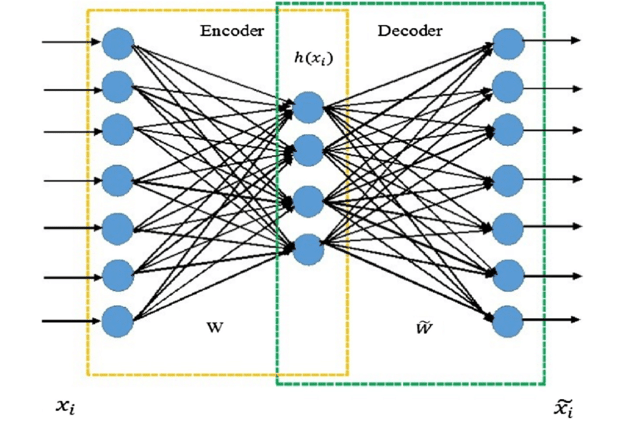

# Autoencoder-for-clustering

> 书卷多情似故人，晨昏忧乐每相亲<a href='#fn1' name='fn1b'><sup>[1]</sup></a>。

[无监督学习(Unsupervised Learning, UL)](https://en.wikipedia.org/wiki/Unsupervised_learning) 是指从无标签的数据中学习出一些有效的特征或表示的学习方式。无监督学习算法一般直接从原始数据中学习，不借助于任何人工给出标签或者反馈等指导信息。典型的无监督学习问题可以分为：

1. 无监督特征学习 (Unsupervised feature learning)，主要方法包括主成分分析 (Principal Component Analysis, PCA)、[稀疏编码 (Sparse coding)](https://blog.metaflow.fr/sparse-coding-a-simple-exploration-152a3c900a7c)、[自编码器 (Autoencoder, AE)](https://en.wikipedia.org/wiki/Autoencoder) 等；
2. 概率密度估计 (Probabilistic density estimation)，主要方法可以分为参数密度估计 (Parametric density estimation) 和非参数密度 (Nonparametric density estimation) 估计两种；
3. 聚类 (Clustering) ，常见的算法包括 [k-means 算法](https://en.wikipedia.org/wiki/K-means_clustering)、[谱聚类 (Spectral clustering)](https://www.cnblogs.com/pinard/p/6221564.html) 等。

自编码器是一种无监督特征学习的神经网络模型，它的学习目标是将输入层数据 $x$ 通过转换得到其隐藏层的表示 ，然后由隐藏层重构（编码），还原出新的输入数据 （解码），训练目标则是使得重构之后的数据  能够尽量的还原输入层的数据 。如果输出层的数值是任意的数值，则通常采用均方误差来定义损失函数，而对于二值神经网络，损失函数则通常可以由交叉熵来定义。在自编码器学习到有效的数据表示（特征）之后，则可以利用 k-means算法（无监督学习聚类模型）实现对原始输入数据的聚类。

需要安装的库包括：

```
tensorFlow 1.12.0 
tensorboard 1.12.2
numpy 1.15.4  
matplotlib 2.0.2  
```
#### 自编码器 - 特征映射

最简单的自编码器的结构<a href='#fn2' name='fn2b'><sup>[2]</sup></a>如下图所示：

<div align="center">

</div>


首先提取 [MNIST 数据集](https://en.wikipedia.org/wiki/MNIST_database) 中所有的 0, 1 的图像（共11623幅）：

<div align="center">

</div>

按照上述自编码器的结构搭建网络模型，通过可视化过程，可以得到模型的损失曲线（损失函数为均方误差）及训练完成后的自编码器重建的图像，如下图所示：

<table align="center" style="height:200;width:800;" border="1">
<tr>
  <td align="center"></td>
  <td align="center"></td>
</tr>
<tr>
  <td align="center">重建损失随迭代次数的变化曲线</td>
  <td align="center">训练完成后的自编码器重建的图像</td> 
</tr>
</table>

#### k-means 算法 - 特征聚类

K-means 算法是当前最流行和经典的聚类方法之一，其核心思想是：对数据集 ，考虑所有可能的  个簇集合，希望能找到一个簇集合 ，使得每个点到对应簇的中心的距离的平方和最小。

最终得到 0, 1 图像在自编码器特征映射之后的空间分布及通过 k-means 算法实现特征映射的聚类（红色五角星标记的是两个类簇的中心）。

<div align="center">

</div>
-----

##### 脚注 (Footnote)

<a name='fn1'>[1]</a>: [观书 -- 于谦](https://so.gushiwen.org/shangxi_5292.aspx)

<a name='fn2'>[2]</a>: [HOA Ahmed, MLD Wong, AK Nandi - Mechanical Systems and Signal Processing, 2018.](https://www.sciencedirect.com/science/article/pii/S0888327017303394)

<a href='#fn1b'><small>↑Back to Content↑</small></a>